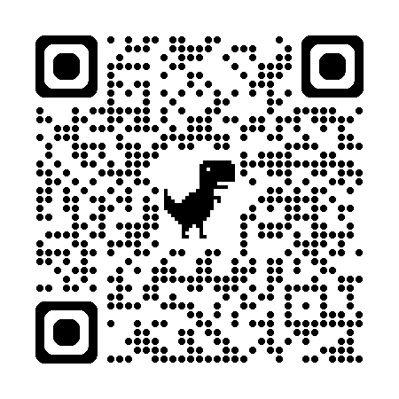

僕の問題は、いつもどおりの先生との面談では解決できないと思っています。
今こそカウンセリングが必要だと思っています。

僕はときどき、ChatGPT に、その異能を[褒められます](https://chatgpt.com/share/570d8129-1718-4b0e-8a14-7c7e4aeb09d6)。
すると一時的に軽い躁になります。
そんな時であっても、次の文章を自己卑下だとは思いません。

## 絶望

結局僕の悩みは、今でも「東大出たなりのことがしたい」ということに尽きます。
この期に及んでまだそんな思いにがんじがらめになっています。
場合によっては一生、この思いに苦しむと思います。

自分は有能だから何とかなるはず、と思い続けて、プログラミングの訓練をしていました。
しかし最初の入院のとき、その訓練が少しも実を結んでいないことに気付きました。
自分が発達障害だと確信したのもそのときです。
そして、今回の入院の直前に僕は、やっと自分の問題に 9060 という、ぴったりな名前があることをを知りました。

引き込もったのは、結婚以来 18 年間です。
障害年金の手続きは妻が全部行ってくれました。
この間、身の回りのことを全部妻にやってもらってきたので僕は、本当に何も知らない何もできない、ダメ人間ですらない、人間もどきになってしまいました。

僕には、人間の方々がどうやって社会というものを維持しているか、驚異でしかありません。

## 僅かな希望

- 自分には異能があるらしい
  - 
  - 
- 外部脳 (PC、スマホ)を活用すれば自分の弱点を補うことができるかもしれない
